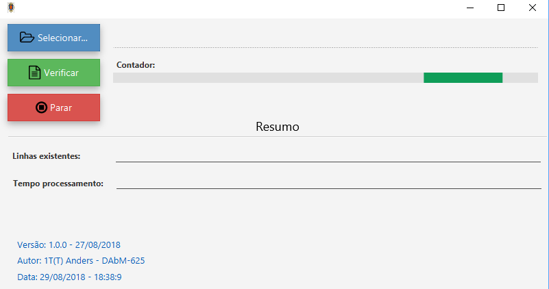

# Projeto com JavaFX

Projeto de uso pessoal simples em Java Desktop com **JavaFX** de Contagem de linhas arquivos **csv** e **txt**.

## Tecnologias utilizadas

- **Java 8** com **FX** - Linguagem de programação;
- **Maven** - Gerenciador de dependências;;
- **Inno Setup Compiler** - Gerador de pacote de instalação;
- **Launch4j** - Alteração de arquivos JAR para EXE.

## Tela do Projeto

